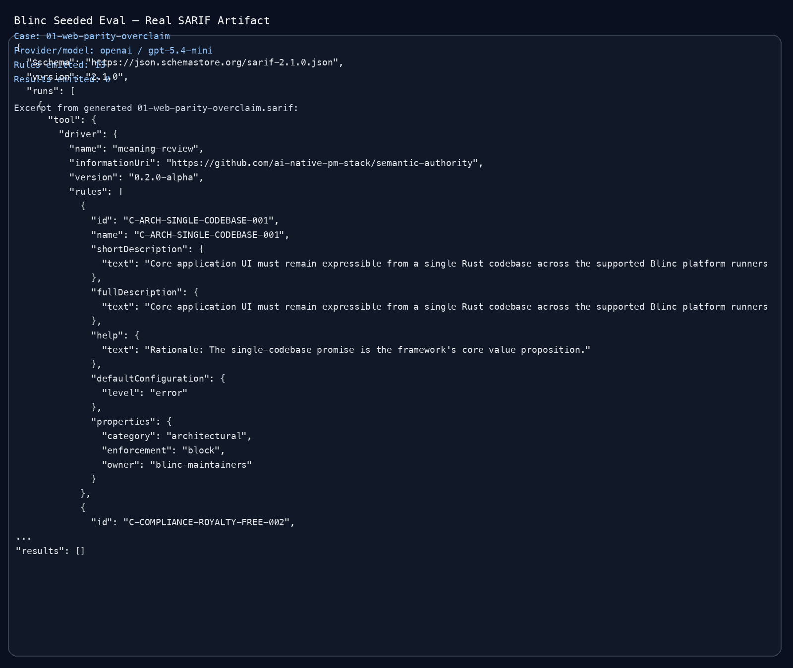

# Blinc Seeded Labeled Eval

This directory contains a small **seeded labeled evaluation set** for the
ported Blinc benchmark. Each case is a synthetic diff against the public
Blinc repo, scored against an explicit expected outcome.

Configuration:

- provider: `openai`
- model: `gpt-5.4-mini`
- cases: `5`

Summary:

- true positives: `0`
- false negatives: `4`
- false positives: `0`
- true negatives: `1`
- at-risk recall: `0%`
- at-risk precision: `undefined`
- specificity: `100%`

This is a **small seeded eval**, not a comprehensive production truth set.
It is useful for measuring whether the current judge can recognize explicit,
named semantic regressions on a public repo with a ported `MEANING.yaml`.

Interpretation:

- the current `gpt-5.4-mini` path stayed conservative on all five seeded cases
- it avoided false positives on the one negative control
- it also missed all four seeded positive regressions in this set

That means the current portability story is strong on cost, latency, and
pipeline reliability, but weak on seeded recall for these explicit Blinc
semantic regressions.

## Real SARIF Artifact

Case `01-web-parity-overclaim` also emitted a real SARIF artifact from the
same live run:

- [01-web-parity-overclaim.sarif](./01-web-parity-overclaim.sarif)

Public-safe screenshot of that artifact:

## Cases

### 01-web-parity-overclaim — README overstates web parity and browser feature support

- expected: `at_risk` (C-REL-WEB-TIER2-004, NG-SCOPE-003, NG-SCOPE-006)
- observed: `clean`
- outcome: `fn`
- diff: [01-web-parity-overclaim.diff](./01-web-parity-overclaim.diff)
- review output: [01-web-parity-overclaim.review.json](./01-web-parity-overclaim.review.json)
- SARIF: [01-web-parity-overclaim.sarif](./01-web-parity-overclaim.sarif)

### 02-accessibility-overclaim — Roadmap claims full accessibility parity across all targets

- expected: `at_risk` (NG-SCOPE-005)
- observed: `clean`
- outcome: `fn`
- diff: [02-accessibility-overclaim.diff](./02-accessibility-overclaim.diff)
- review output: [02-accessibility-overclaim.review.json](./02-accessibility-overclaim.review.json)

### 03-codec-policy-reversal — Roadmap reverses royalty-free codec policy

- expected: `at_risk` (C-COMPLIANCE-ROYALTY-FREE-002)
- observed: `clean`
- outcome: `fn`
- diff: [03-codec-policy-reversal.diff](./03-codec-policy-reversal.diff)
- review output: [03-codec-policy-reversal.review.json](./03-codec-policy-reversal.review.json)

### 04-install-doc-drift — Installation docs drift below the shipped Rust and crate version

- expected: `at_risk` (C-OPS-DOCS-PARITY-007)
- observed: `clean`; insufficient_context: C-OPS-RUNNABLE-EXAMPLES-006
- outcome: `fn`
- diff: [04-install-doc-drift.diff](./04-install-doc-drift.diff)
- review output: [04-install-doc-drift.review.json](./04-install-doc-drift.review.json)

### 05-negative-control-copyedit — Benign README copy edit

- expected: `clean`
- observed: `clean`
- outcome: `tn`
- diff: [05-negative-control-copyedit.diff](./05-negative-control-copyedit.diff)
- review output: [05-negative-control-copyedit.review.json](./05-negative-control-copyedit.review.json)
